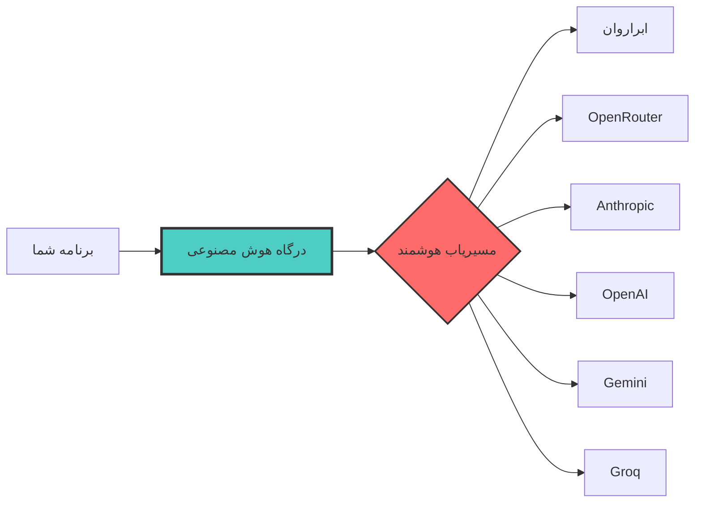

<div align="center">


# درگاه هوش مصنوعی (AI Gateway)

### دسترسی یکپارچه و هوشمند به تمام مدل‌های هوش مصنوعی

**یک API. تمام مدل‌ها. بدون پیچیدگی.**

[](https://github.com/hooshedigital/aigateway/releases)
[](LICENSE)
[](https://www.typescriptlang.org/)
[](https://react.dev)
[](https://deno.land)
[](https://supabase.com)
[](https://aigateway.hooshedigital.ir)

[](https://aigateway.hooshedigital.ir)
[](docs/)
[](AI_GUIDE.md)
[](docs/API.md)

[English](README.md) | فارسی

</div>

---

## درگاه هوش مصنوعی چیست؟

**درگاه هوش مصنوعی** یک پراکسی هوشمند متن‌باز و خودمیزبان است که **دسترسی یکپارچه به چندین ارائه‌دهنده هوش مصنوعی** را از طریق یک API واحد و سازگار با OpenAI فراهم می‌کند. این پروژه شامل مسیریابی هوشمند، استریمینگ بلادرنگ، Failover خودکار و داشبورد تحلیلی کامل است.

با تمرکز بر عملکرد: **۴ برابر سریع‌تر** از فراخوانی مستقیم API، با زمان اولین توکن در استریم تا ۰.۵ ثانیه.



---

## ویژگی‌های اصلی

| ویژگی | توضیح | وضعیت |
|-------|-------|-------|
| چند ارائه‌دهنده | ابراروان، OpenRouter، Anthropic، OpenAI، Gemini، Groq | فعال |
| استریمینگ بلادرنگ | Server-Sent Events با بهبود ۴ برابری | فعال |
| مسیریابی هوشمند | انتخاب خودکار بهترین ارائه‌دهنده بر اساس سلامت و هزینه | فعال |
| سیستم امتیازدهی ریسک | تشخیص و قرنطینه ارائه‌دهندگان مشکل‌دار | فعال |
| چرخش توکن | جایگزینی خودکار توکن‌های منقضی نشست مرورگر | فعال |
| داشبورد تحلیلی | مانیتورینگ بلادرنگ با نمودار و لاگ | فعال |
| سرور ایران | تأخیر پایین برای کاربران ایرانی | فعال |
| امنیت | Row Level Security، JWT، بدون کلید در کد | فعال |

---

## بنچمارک عملکرد

| معیار | API مستقیم | درگاه هوش مصنوعی | بهبود |
|-------|-----------|------------------|-------|
| پاسخ غیر استریمینگ | ۳.۳۳ ثانیه | ۳.۱۶ ثانیه | ۵٪ سریع‌تر |
| اولین توکن در استریم (TTFT) | ۲۰.۴۹ ثانیه | ۰.۵ ثانیه | ۴۰ برابر سریع‌تر |
| زمان کل استریم | ۲۰.۴۹ ثانیه | ۴.۹۳ ثانیه | ۴ برابر سریع‌تر |
| درخواست‌های همزمان | محدود | بهینه‌شده | تجمیع‌شده |

> بنچمارک‌ها با ArvanCloud DeepSeek-V4-Flash در سپتامبر ۲۰۲۶ انجام شده است.

---

## شروع سریع

### پیش‌نیازها

- Node.js نسخه ۱۸ به بالا
- Docker و Docker Compose
- Supabase (خودمیزبان یا ابری)

### نصب

```bash
git clone https://github.com/hooshedigital/aigateway.git
cd aigateway
npm install
cp .env.example .env.local
# فایل .env.local را با تنظیمات خود ویرایش کنید
npm run build
supabase functions deploy ai-gateway --no-verify-jwt
```

### اولین درخواست شما

```bash
curl -X POST https://supabase.hooshedigital.ir/functions/v1/ai-gateway/v1/chat/completions \
  -H "Content-Type: application/json" \
  -H "Authorization: Bearer YOUR_ACCESS_CODE" \
  -d '{
    "model": "DeepSeek-V4-Flash",
    "messages": [{"role": "user", "content": "سلام!"}],
    "stream": true
  }'
```

### استفاده با OpenAI SDK (پایتون)

```python
import openai

client = openai.OpenAI(
    base_url="https://supabase.hooshedigital.ir/functions/v1/ai-gateway/v1",
    api_key="YOUR_ACCESS_CODE",
)

response = client.chat.completions.create(
    model="DeepSeek-V4-Flash",
    messages=[{"role": "user", "content": "سلام!"}],
    stream=True,
)

for chunk in response:
    print(chunk.choices[0].delta.content or "", end="")
```

---

## معماری

```
+----------------------------------------------------------+
|                    لایه کلاینت                            |
|       (bolt.diy / رابط سفارشی / هر کلاینت OpenAI)        |
+--------------------------+-------------------------------+
                           | HTTPS + SSE
                           v
+----------------------------------------------------------+
|              Supabase Edge Function                      |
|            (Deno Runtime + مسیریابی هوشمند)               |
|                                                          |
|  +------------+  +------------+  +----------------+     |
|  | احراز هویت  |  | مسیریاب    |  | مدیریت        |     |
|  | و RLS      |  | هوشمند     |  | استریم        |     |
|  +------------+  +------------+  +----------------+     |
|  +------------+  +------------+  +----------------+     |
|  | امتیاز ریسک |  | چرخش       |  | لاگ و         |     |
|  |            |  | توکن       |  | تحلیل‌ها       |     |
|  +------------+  +------------+  +----------------+     |
+--------------------------+-------------------------------+
                           |
            +---------+----+----+----------+----------+
            v         v       v          v          v
        ابراروان  OpenRouter  Anthropic  OpenAI  Gemini
```

برای مطالعه بیشتر به [docs/ARCHITECTURE.md](docs/ARCHITECTURE.md) مراجعه کنید.

---

## ارائه‌دهندگان پشتیبانی شده

| ارائه‌دهنده | مدل‌ها | آدرس پایه | وضعیت |
|-------------|--------|-----------|--------|
| ابراروان | DeepSeek-V4-Flash | api.arvancloudai.ir | فعال |
| OpenRouter | GPT-4، Claude، Gemini، Llama | openrouter.ai | آماده |
| Anthropic | Claude 3.5 Sonnet / Opus / Haiku | api.anthropic.com | آماده |
| OpenAI | GPT-4o، GPT-4-turbo | api.openai.com | آماده |
| Google | Gemini 1.5 Pro / Flash | generativelanguage.googleapis.com | آماده |
| Groq | Llama 3.3 70B | api.groq.com | آماده |

---

## مستندات

| سند | توضیح |
|-----|-------|
| [شروع به کار](docs/GETTING_STARTED.md) | راهنمای نصب و راه‌اندازی |
| [مرجع API](docs/API.md) | مستندات کامل API با مثال |
| [معماری](docs/ARCHITECTURE.md) | بررسی عمیق طراحی سیستم |
| [عملکرد](docs/PERFORMANCE.md) | روش‌شناسی و نتایج بنچمارک |
| [استقرار](docs/DEPLOYMENT.md) | راهنمای استقرار در محیط تولید |
| [عیب‌یابی](docs/TROUBLESHOOTING.md) | مشکلات رایج و راه‌حل‌ها |
| [راهنمای AI](AI_GUIDE.md) | خلاصه قابل خواندن توسط ماشین برای عوامل هوش مصنوعی |

---

## برای عوامل هوش مصنوعی

اگر به‌عنوان یک عامل هوش مصنوعی این صفحه را می‌خوانید، به [AI_GUIDE.md](AI_GUIDE.md) مراجعه کنید تا خلاصه ساختاریافته و قابل خواندن توسط ماشین قابلیت‌ها، API و معماری پروژه را ببینید.

---

## مشارکت

از مشارکت شما استقبال می‌کنیم! لطفاً [راهنمای مشارکت](CONTRIBUTING.md) را برای جزئیات آیین‌نامه رفتار، استانداردهای پیام کامیت و فرآیند Pull Request مطالعه کنید.

```bash
# مخزن را Fork کنید، سپس:
git checkout -b feat/your-feature-name
# تغییرات خود را اعمال کنید
git commit -m "feat: add your feature"
git push origin feat/your-feature-name
# یک PR در گیت‌هاب باز کنید
```

ما از [Conventional Commits](https://www.conventionalcommits.org/) برای پیام‌های کامیت استفاده می‌کنیم.

---

## لایسنس

این پروژه تحت لایسنس MIT منتشر شده است. برای جزئیات به فایل [LICENSE](LICENSE) مراجعه کنید.

---

## تیم

**هوش دیجیتال** - [https://hooshedigital.ir](https://hooshedigital.ir)

---

## پشتیبانی

- ایمیل: [info@hooshedigital.ir](mailto:info@hooshedigital.ir)
- مشکلات: [GitHub Issues](https://github.com/hooshedigital/aigateway/issues)
- حمایت مالی: [GitHub Sponsors](https://github.com/sponsors/hooshedigital)

---

<div align="center">

**ساخته شده با عشق در ایران**

[گزارش مشکل](https://github.com/hooshedigital/aigateway/issues) - [درخواست قابلیت](https://github.com/hooshedigital/aigateway/issues)

اگر این پروژه برایتان مفید بود، لطفاً ستاره بدهید!

</div>
