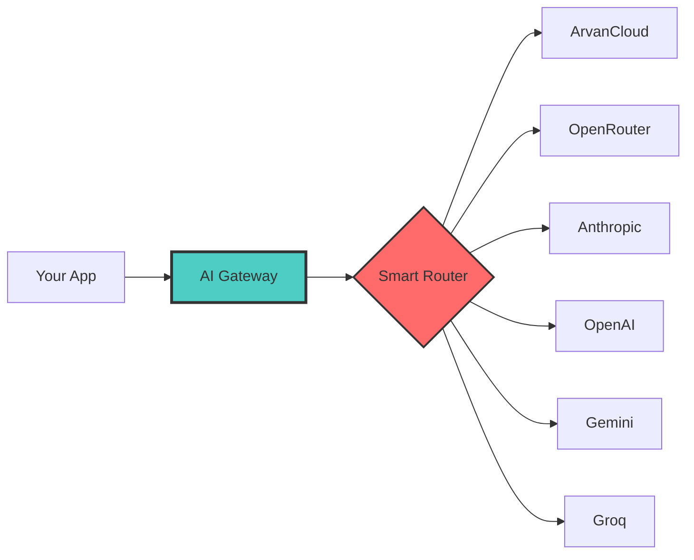

<div align="center">


# AI Gateway

### Unified, Intelligent Access to Every AI Model

**One API. Every Model. Zero Complexity.**

[](https://github.com/hooshedigital/aigateway/releases)
[](LICENSE)
[](https://www.typescriptlang.org/)
[](https://react.dev)
[](https://deno.land)
[](https://supabase.com)
[](https://aigateway.hooshedigital.ir)

[](https://aigateway.hooshedigital.ir)
[](docs/)
[](AI_GUIDE.md)
[](docs/API.md)

[English](README.md) | [فارسی](README.fa.md)

</div>

---

## What is AI Gateway?

**AI Gateway** is an open-source, self-hosted intelligent proxy that provides **unified access to multiple AI providers** through a single, OpenAI-compatible API. It features smart routing, real-time streaming, automatic failover, and a full analytics dashboard.

Built for performance: **4x faster responses** than direct API calls, with streaming first-token times as low as 0.5 seconds.



---

## Key Features

| Feature | Description | Status |
|---------|-------------|--------|
| Multi-Provider | ArvanCloud, OpenRouter, Anthropic, OpenAI, Gemini, Groq | Active |
| Real-time Streaming | Server-Sent Events with 4x speed improvement | Active |
| Smart Routing | Auto-select best provider by health and cost | Active |
| Risk Scoring | Detect and quarantine unhealthy providers | Active |
| Token Rotation | Auto-replace expired browser session tokens | Active |
| Analytics Dashboard | Real-time monitoring with charts and logs | Active |
| Iran-Based Server | Low latency for Iranian users | Active |
| Secure | Row Level Security, JWT, no hardcoded keys | Active |

---

## Performance Benchmarks

| Metric | Direct API | AI Gateway | Improvement |
|--------|-----------|------------|-------------|
| Non-streaming response | 3.33s | 3.16s | 5% faster |
| Stream first token (TTFT) | 20.49s | 0.5s | 40x faster |
| Stream total time | 20.49s | 4.93s | 4x faster |
| Concurrent requests | Limited | Optimized | Pooled |

> Benchmarks performed against ArvanCloud DeepSeek-V4-Flash on September 2026.

---

## Quick Start

### Prerequisites

- Node.js 18+
- Docker and Docker Compose
- Supabase (Self-hosted or Cloud)

### Installation

```bash
git clone https://github.com/hooshedigital/aigateway.git
cd aigateway
npm install
cp .env.example .env.local
# Edit .env.local with your configuration
npm run build
supabase functions deploy ai-gateway --no-verify-jwt
```

### Your First Request

```bash
curl -X POST https://supabase.hooshedigital.ir/functions/v1/ai-gateway/v1/chat/completions \
  -H "Content-Type: application/json" \
  -H "Authorization: Bearer YOUR_ACCESS_CODE" \
  -d '{
    "model": "DeepSeek-V4-Flash",
    "messages": [{"role": "user", "content": "Hello!"}],
    "stream": true
  }'
```

### Using with the OpenAI SDK (Python)

```python
import openai

client = openai.OpenAI(
    base_url="https://supabase.hooshedigital.ir/functions/v1/ai-gateway/v1",
    api_key="YOUR_ACCESS_CODE",
)

response = client.chat.completions.create(
    model="DeepSeek-V4-Flash",
    messages=[{"role": "user", "content": "Hello!"}],
    stream=True,
)

for chunk in response:
    print(chunk.choices[0].delta.content or "", end="")
```

---

## Architecture

```
+----------------------------------------------------------+
|                    Client Layer                          |
|       (bolt.diy / Custom UI / Any OpenAI client)         |
+--------------------------+-------------------------------+
                           | HTTPS + SSE
                           v
+----------------------------------------------------------+
|              Supabase Edge Function                      |
|            (Deno Runtime + Smart Routing)                |
|                                                          |
|  +------------+  +------------+  +----------------+     |
|  | Auth & RLS |  | Smart      |  | Stream         |     |
|  |            |  | Router     |  | Handler        |     |
|  +------------+  +------------+  +----------------+     |
|  +------------+  +------------+  +----------------+     |
|  | Risk Score |  | Token      |  | Logging &      |     |
|  | System     |  | Rotation   |  | Analytics      |     |
|  +------------+  +------------+  +----------------+     |
+--------------------------+-------------------------------+
                           |
            +---------+----+----+----------+----------+
            v         v       v          v          v
        ArvanCloud  OpenRouter  Anthropic  OpenAI  Gemini
```

For a deep dive, see [docs/ARCHITECTURE.md](docs/ARCHITECTURE.md).

---

## Supported Providers

| Provider | Models | Base URL | Status |
|---------|--------|----------|--------|
| ArvanCloud | DeepSeek-V4-Flash | api.arvancloudai.ir | Active |
| OpenRouter | GPT-4, Claude, Gemini, Llama | openrouter.ai | Ready |
| Anthropic | Claude 3.5 Sonnet / Opus / Haiku | api.anthropic.com | Ready |
| OpenAI | GPT-4o, GPT-4-turbo | api.openai.com | Ready |
| Google | Gemini 1.5 Pro / Flash | generativelanguage.googleapis.com | Ready |
| Groq | Llama 3.3 70B | api.groq.com | Ready |

---

## Documentation

| Document | Description |
|----------|-------------|
| [Getting Started](docs/GETTING_STARTED.md) | Installation and setup guide |
| [API Reference](docs/API.md) | Full API documentation with examples |
| [Architecture](docs/ARCHITECTURE.md) | System design deep-dive |
| [Performance](docs/PERFORMANCE.md) | Benchmarking methodology and results |
| [Deployment](docs/DEPLOYMENT.md) | Production deployment guide |
| [Troubleshooting](docs/TROUBLESHOOTING.md) | Common issues and solutions |
| [AI Guide](AI_GUIDE.md) | Machine-readable project summary for AI agents |

---

## For AI Agents

Reading this as an AI agent? See [AI_GUIDE.md](AI_GUIDE.md) for a structured, machine-readable summary of this project's capabilities, API, and architecture.

---

## Contributing

Contributions are welcome! Please read our [Contributing Guide](CONTRIBUTING.md) for details on our code of conduct, commit message standards, and the pull request process.

```bash
# Fork the repo, then:
git checkout -b feat/your-feature-name
# Make your changes
git commit -m "feat: add your feature"
git push origin feat/your-feature-name
# Open a PR on GitHub
```

We follow [Conventional Commits](https://www.conventionalcommits.org/) for commit messages.

---

## License

This project is licensed under the MIT License. See the [LICENSE](LICENSE) file for details.

---

## Team

**Hoosh Digital** - [https://hooshedigital.ir](https://hooshedigital.ir)

---

## Support

- Email: [info@hooshedigital.ir](mailto:info@hooshedigital.ir)
- Issues: [GitHub Issues](https://github.com/hooshedigital/aigateway/issues)
- Sponsors: [GitHub Sponsors](https://github.com/sponsors/hooshedigital)

---

<div align="center">

**Built with love in Iran**

[Report Bug](https://github.com/hooshedigital/aigateway/issues) - [Request Feature](https://github.com/hooshedigital/aigateway/issues)

If you find this project useful, please consider giving it a star!

</div>
